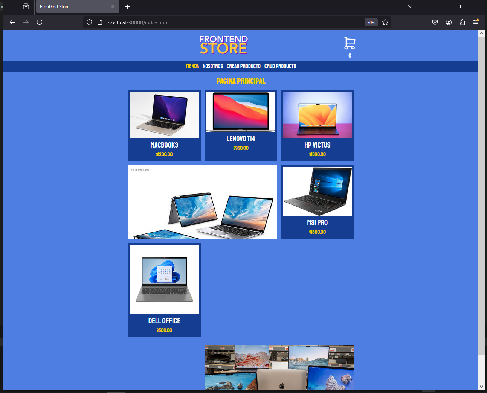
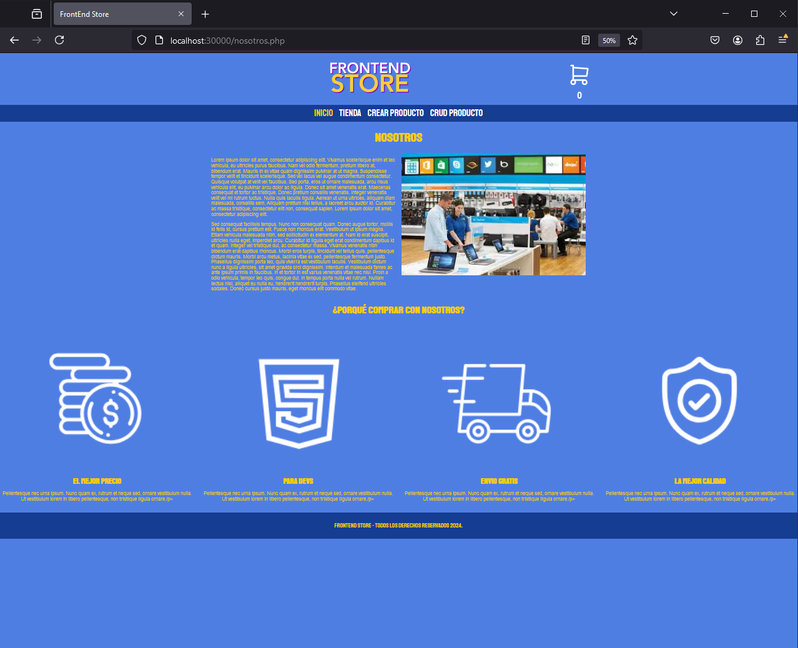
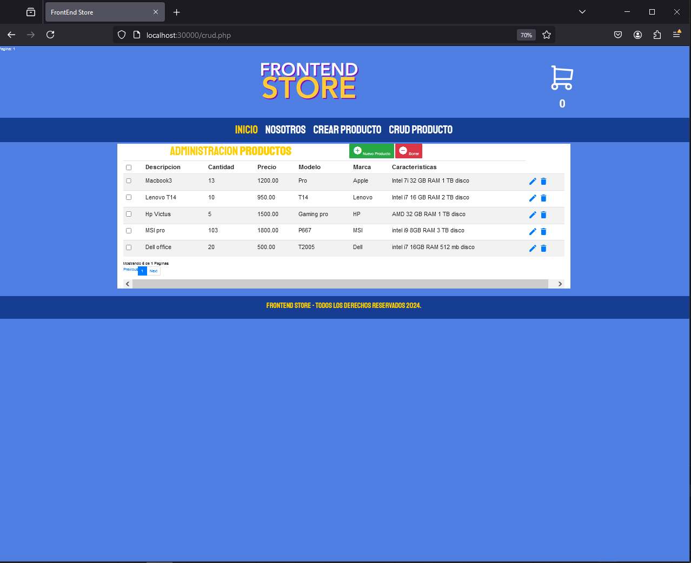

# Tienda Virtual en PHP, CSS y JavaScript

## Descripción

Este proyecto consiste en una tienda virtual dinámica creada con **PHP**, **HTML** ,**CSS** y **JavaScript**. El propósito principal del proyecto es aprender y aplicar los conceptos de un CRUD (Crear, Leer, Actualizar, Eliminar) en una tienda online. Utilicé **MySQL** para almacenar los datos, que incluyen imágenes, descripciones y precios de los productos. Además, implementé el uso de **cookies** para gestionar la sesión del usuario.

El proyecto fue desarrollado con fines de aprendizaje, enfocándose en los siguientes aspectos:

- **Interacción con bases de datos (MySQL)**
- **Gestión del carrito de compras utilizando cookies**
- **Implementación de CRUD básico**
- **Diseño y desarrollo frontend con CSS y JavaScript**

## Funcionalidades

- **Página de inicio**: Muestra una lista de productos con su respectiva imagen, descripción y precio.
- **Carrito de compras**: Los usuarios pueden agregar productos al carrito utilizando cookies para mantener la sesión activa.
- **CRUD**: Administradores pueden añadir, editar y eliminar productos desde el panel de administración.
- **Interactividad**: La tienda permite agregar productos al carrito y ver detalles de cada uno.
  
## Tecnologías Utilizadas

- **PHP**: Para la lógica de backend, incluyendo la conexión a la base de datos y la gestión de sesiones.
- **CSS**: Para el diseño y la apariencia visual de la tienda.
- **JavaScript**: Para la interactividad y la manipulación dinámica del DOM.
- **MySQL**: Para almacenar los productos, sus descripciones, precios e imágenes.
- **Cookies**: Para gestionar las sesiones de usuario y mantener la persistencia de datos en el carrito.

## imagenes

# English

# Virtual Store in PHP, CSS, and JavaScript

## Description

This project is a dynamic virtual store created with **PHP**, **HTML**, **CSS**, and **JavaScript**. The main purpose of the project is to learn and apply the concepts of a CRUD (Create, Read, Update, Delete) in an online store. I used **MySQL** to store the data, including images, descriptions, and prices of the products. Additionally, I implemented the use of **cookies** to manage the user's session.

The project was developed for learning purposes, focusing on the following aspects:

- **Interaction with databases (MySQL)**
- **Shopping cart management using cookies**
- **Basic CRUD implementation**
- **Frontend design and development with CSS and JavaScript**

## Features

- **Homepage**: Displays a list of products with their respective images, descriptions, and prices.
- **Shopping cart**: Users can add products to the cart using cookies to maintain the session.
- **CRUD**: Administrators can add, edit, and delete products from the admin panel.
- **Interactivity**: The store allows adding products to the cart and viewing details of each one.

## Technologies Used

- **PHP**: For backend logic, including database connection and session management.
- **CSS**: For design and visual appearance of the store.
- **JavaScript**: For interactivity and dynamic DOM manipulation.
- **MySQL**: For storing products, their descriptions, prices, and images.
- **Cookies**: To manage user sessions and maintain data persistence in the cart.

## Images

